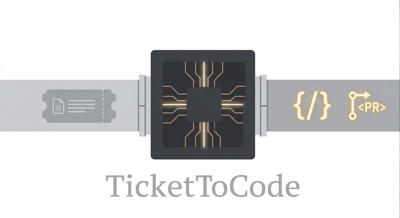

<p align="center">
  
</p>

<h1 align="center">ticket-to-code</h1>

<p align="center">
  An AI-powered engineering assistant that picks up <strong>Jira tasks</strong>, generates execution plans using <strong>DSPy + LiteLLM</strong>, identifies the exact files to change, and dispatches work to <strong>GitHub Actions</strong> — opening a PR for human review.
</p>

> **ticket-to-code** handles well-defined, repeatable tasks — infrastructure changes, feature work, config updates — so your team can focus on the hard problems.

> ℹ️ **No vendor lock-in.** Uses fully open-source tooling (DSPy, LiteLLM) and is model-agnostic — works with OpenAI, Anthropic, Azure, or local models via Ollama.

---

## How It Works

```
┌─────────┐      ┌────────────────────────────┐        ┌─────────────────────────┐      ┌───────────────┐
│  Jira   │─────▶│  Agent 1 (Agentcore)       │─────▶  │  Agent 2 (GH Actions)   │─────▶│  Pull Request │
│  (task) │      │  Router + Scope Identifier │        │  Executor + Validator   │      │  (for review) │
└─────────┘      └────────────────────────────┘        └─────────────────────────┘      └───────────────┘
     │                    │                                  │
     │  1. Label issue    │  2. Classify task (DSPy)         │  5. Read identified files
     │     "ai-task"      │  3. Navigate repo tree (API)     │  6. Scope expansion (siblings)
     │                    │  4. Identify exact file paths    │  7. AI edits files
     │                    │     → dispatch to Actions        │  8. Validate + commit + PR
```

### Two-Agent Architecture

| Agent | Where it runs | Responsibility |
|-------|---------------|----------------|
| **Agent 1** (Agentcore) | Docker / local server | ALL intelligence — routing, planning, scope identification |
| **Agent 2** (Executor) | GitHub Actions | Pure executor — reads files, makes edits, validates, opens PR |

**Agent 1** does all the thinking:
1. Receives Jira webhook → classifies task type with DSPy
2. Generates step-by-step execution plan
3. **Scope Identifier**: Navigates the repo tree via GitHub Trees API (level-by-level, LLM picks which directory to drill into), then identifies exact file paths
4. Dispatches to GitHub Actions with exact paths + plan

**Agent 2** is a dumb executor:
1. Reads the files Agent 1 identified
2. **Scope Expansion**: Asks Claude if it needs any sibling files in the same directory (catches files Agent 1 missed from filenames alone)
3. Sends files + plan to Claude for code edits
4. Writes changes, runs validation, commits, opens PR

---

## Scope Identifier

The scope identifier is the key innovation — it finds exact file paths in any monorepo without hardcoded paths.

**How it works:**
```
Phase 1 — Navigate (LLM browses the tree like a file browser):
  Depth 0: (root)         → LLM picks: infra/
  Depth 1: infra/         → LLM picks: terraform/
  Depth 2: terraform/     → LLM picks: providers/
  Depth 3: providers/     → LLM picks: aws/
  (reached target directory)

Phase 2 — Identify (recursive fetch of that directory):
  → 23 files in infra/ sent to LLM
  → LLM picks: module.containers.eks.tf, locals.tf, variables.tf, etc.
```

- **Zero hardcoded paths** — works with any monorepo structure
- **No cloning required** — uses GitHub Trees API (single API call per level)
- **Never truncates** — fetches one directory at a time, avoids the 50K file limit

---

## Quick Start

### 1. Clone & Install

```bash
git clone https://github.com/pranavsriram8/ticket-to-code.git
cd ticket-to-code
python -m venv .venv
source .venv/bin/activate
pip install -r requirements.txt
```

### 2. Configure Environment

```bash
cp .env.example .env
```

Edit `.env` with your real values:

```env
# Jira
JIRA_BASE_URL=https://your-org.atlassian.net
JIRA_USER_EMAIL=you@example.com
JIRA_API_TOKEN=your_token

# GitHub (PAT needs repo + actions scopes)
GITHUB_PAT=ghp_your_token
GITHUB_REPO=your-org/your-monorepo

# LLM (via LiteLLM — supports OpenAI, Anthropic, Azure, Ollama, etc.)
LITELLM_MODEL=openai/gpt-4o
OPENAI_API_KEY=sk-your-key

# The label that triggers TicketToCode
TICKET_LABEL=ai-task
```

### 3. Run with Docker Compose

```bash
docker compose up --build -d
```

### 4. Run Locally (without Docker)

```bash
uvicorn app.main:app --reload --port 8000
```

### 5. Expose to Jira (for webhooks)

```bash
ngrok http 8000
```

Configure your Jira webhook to point at:
```
https://<your-ngrok-url>/api/webhooks/jira
```

---

## Dry Run Mode

Test the full Router + Scope Identifier pipeline **without triggering GitHub Actions**.

### Usage

```bash
curl -s -X POST http://localhost:8000/api/dry-run \
  -H "Content-Type: application/json" \
  -d '{
    "task_title": "Upgrade EKS cluster to Kubernetes 1.34",
    "task_description": "Upgrade backend-cluster from K8s 1.33 to 1.34. Update cluster_version in terraform."
  }' | python3 -m json.tool
```

### Response

```json
{
  "task_type": "terraform",
  "router_target_paths": "(guessed paths — may be inaccurate)",
  "scope_identified_paths": "infra/terraform/providers/aws/env/misc/module.containers.eks.tf,infra/terraform/providers/aws/env/misc/variables.tf,...",
  "plan": "1. Locate the cluster_version argument...",
  "validation_commands": "terraform fmt,terraform validate,terraform plan"
}
```

### What it does

| Field | Description |
|-------|-------------|
| `task_type` | Classification from DSPy router (terraform, helm, ansible, etc.) |
| `router_target_paths` | Router's guessed paths (no repo access — usually inaccurate) |
| `scope_identified_paths` | **Real paths** from scope identifier (navigated via GitHub Trees API) |
| `plan` | Step-by-step execution plan |
| `validation_commands` | Safe commands the agent would run |

### When to use it

- **Testing** — Verify scope identification finds the right files before enabling full dispatch
- **Debugging** — See exactly which directories the LLM navigated through (check Docker logs)
- **Demos** — Show the intelligence pipeline without any side effects

---

## API Endpoints

| Method | Path | Description |
|--------|------|-------------|
| `GET` | `/` | Service info |
| `GET` | `/health` | Liveness probe |
| `GET` | `/docs` | Interactive Swagger UI |
| `POST` | `/api/dry-run` | **Dry run** — Route + Scope only (no dispatch) |
| `POST` | `/api/webhooks/jira` | Jira webhook receiver (triggers full pipeline) |
| `POST` | `/api/webhooks/github` | GitHub webhook receiver (legacy) |

---

## Project Structure

```
ticket-to-code/
├── app/
│   ├── main.py                    # FastAPI entry point — webhooks + dry-run endpoint
│   ├── core/
│   │   └── config.py              # Pydantic BaseSettings (all env vars)
│   ├── integration/
│   │   ├── jira_models.py         # Pydantic models for Jira webhook payloads
│   │   ├── jira_webhook.py        # Jira HMAC signature verification
│   │   ├── github_models.py       # Pydantic models for GitHub webhook payloads
│   │   └── github_webhook.py      # GitHub HMAC signature verification
│   ├── coordination/
│   │   ├── router.py              # DSPy + LiteLLM task classifier & planner
│   │   ├── scope_identifier.py    # GitHub Trees API + LLM tree navigation
│   │   └── dispatcher.py          # Orchestrates: Router → Scope → Execute
│   └── execution/
│       ├── base.py                # ExecutionPlan / ExecutionResult models
│       ├── factory.py             # Platform executor factory
│       └── github_executor.py     # GitHub Actions workflow_dispatch trigger
├── agent/
│   ├── __init__.py
│   └── entrypoint.py             # Agent 2 — runs in GitHub Actions (executor)
├── action.yml                     # GitHub Action definition
├── agent-ticket-to-code.yml       # Workflow template (copy to monorepo)
├── docker-compose.yml             # Local dev setup
├── Dockerfile                     # Agent 1 container
├── Dockerfile.action              # Agent 2 container (GitHub Actions)
├── .env.example
├── requirements.txt               # Server dependencies
├── requirements.action.txt        # Agent dependencies
└── README.md
```

---

## Architecture

| Layer | Module | Responsibility |
|---|---|---|
| **Integration** | `app/integration/` | Receives Jira/GitHub webhooks, verifies signatures, parses into typed models |
| **Coordination** | `app/coordination/` | DSPy router classifies tasks, scope identifier finds files, dispatcher orchestrates |
| **Execution** | `app/execution/` | Triggers GitHub Actions `workflow_dispatch` with the plan + exact paths |
| **Agent** | `agent/` | GitHub Action that runs the AI agent — scope expansion, edits, validation, PRs |

---

## Safety Guardrails

The agent operates with strict safety boundaries:

| ✅ Allowed | ❌ Blocked |
|-----------|-----------|
| `terraform fmt` | `terraform apply` |
| `terraform validate` | `terraform destroy` |
| `terraform plan` | `kubectl delete` |
| `helm lint` | `helm install/upgrade` |
| `helm template` | Any write/mutate operation |
| `ansible-lint` | `rm`, `mv` on critical paths |
| `go vet`, `go build` | Direct cloud API calls |

- **Command allowlist** enforced in Agent 2
- **No merge capability** — only opens PRs for human review
- **30-minute timeout** on the GitHub Action runner
- **Concurrency control** — one run per Jira issue at a time
- **Scope expansion limited** to sibling files in the same directory only

---

## Tech Stack

- **FastAPI** + **Uvicorn** — async webhook server
- **Pydantic** — typed models for all payloads & config
- **DSPy** — structured LLM prompting for task classification & planning
- **LiteLLM** — model-agnostic LLM routing (OpenAI, Anthropic, Azure, Ollama)
- **PyGithub** — GitHub API for workflow dispatch, PR creation, and Trees API
- **GitHub Actions** — secure execution environment with CI/CD credentials
- **Docker Compose** — local development and testing

---

## License

MIT
